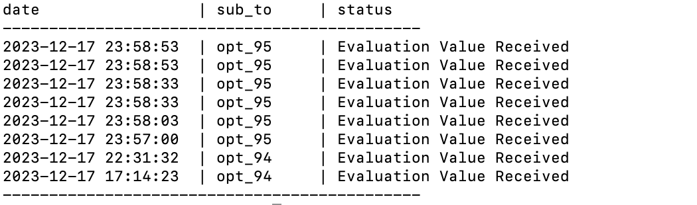

# ECOW(Evolutionary Competition Opt Wrapper)

- [モジュールの概要](#モジュールの概要)
- [モジュールの機能](#モジュールの機能)
- [セットアップ](#セットアップ)
- [使用方法](#使用方法)
- [ECOWチュートリアル](#ECOWチュートリアル)

## モジュールの概要
[進化計算コンペティション](https://ec-comp.jpnsec.org/ja) では、optコマンドを使って解の送信と評価値の受信をしますが、送信した解と評価値の紐づけはユーザーが行う必要がありました。そのため、解の管理に手間がかかり参加者は競技に集中することができませんでした。
そこで、解の管理機能を持つoptコマンドのPythonラッパーとして、ECOW(Evolutionary-computation Competition Opt-command Wrapper)を開発しました。PythonモジュールであるECOWを利用することにより、ユーザー名と問題番号の管理、重複した解の送信の抑制、解と結果組一覧のファイル保存が自動化されます。

## モジュールの機能
- 解の送信・評価値の受信<br>
    解のリストを送信するRun関数は以下のように利用できます。<br>
    ```python
    from ECOW.comp_module.functions.main import Main

    def Run(solutions = None, no_wait=False):
        p = Main()
        result = p.Run(solutions, no_wait)
        return result

    if __name__ == '__main__':
        res = Run([[2,4],[4,4]])
        print(res)
    ```

    解の送信方法は2種類あります。<br>
    1. 引数に解のリストのみを渡し、`no_wait=False`場合、すべての解の評価が終了するまで待機。
    2. 引数に解のリストと`no_wait=True`を渡した場合、ただちに返り値`None`を得て、バックグラウンドで受信した評価値はjsonファイルに保存。

    評価値の受信方法も2種類あります。<br>
    1. サーバから受信した評価データがlist型で返り値として返される。(`no_wait=False`の場合)
    2. サーバーから受信した評価値がjsonファイルに書き込まれた後、保存されたサーバーからの評価値を読み込む。(`no_wait=True`の場合)

- オプション<br>
    Mainクラスは実行時引数を受け取ると以下の処理を行います。
    - ステータスの表示`(-s, --status)`<br>
        サーバーに送信した解の実行状態を標準出力に表示します。

    - ヒストリーの表示`(-hi, --history)`<br>
        指定したmatchIDについて今までに送信した解の評価値と送信日時の情報を標準出力に表示します。
        追加で`(-o, --output)`とファイル名を指定し、表示内容をファイルに保存することができます。

## セットアップ
- `opt`のインストールが必要です
    - optのインストールの仕方は[こちら](https://ec-comp.jpnsec.org/ja/competitions/tutorial)
- `python`のインストールが必要です
- モジュールのインストールが必要です
    `pip install filelock`

## 使用方法
1. __config.jsonにユーザーネーム(username)や送信先(subto, matchID)などの情報を入力
2. 以下のコードを実行

```python
from ECOW.run import Run
Run(解のリスト)
```

結果は__restore_filesの中に保存されます。

解のリストは手動で与えたり、他のプログラムやモジュールから与えてください。

## ECOWチュートリアル
進化計算コンペティションの[チュートリアル](https://ec-comp.jpnsec.org/ja/competitions/tutorial)で行う操作をモジュールを使用して行います
### 送信先の設定
__config.jsonのuser_nameキーの値を自分でopthubに登録したものに変更し、match_idキーの値を送信したい問題のmatchIDに変更します。今回はチュートリアルのmatchIDへ送信するので "match_id" : "1" とします。<br>
```json:__config.json
{
    "main" : {
        "sub_to" : "opt",
        "opt" : {
            "user_name" : "#USERNAME",
            "match_id" : "#MATCHID",
            "script" : {
                "send": "echo ${SOLUSION} | opt submit --match=${ID} --no-wait",
                "get": "opt list solutions --limit ${SENDLISTSIZE} --query \"_and: [{match_id: {_eq: ${ID}}}, {owner: {name: {_eq: ${USERNAME}}}}]\""
            }
        },
        "local":{
            "cmd" : "#opt以外で解の評価をする時のコマンド"
        }
    },
    "status" : {
        "limit": 10
    },
    "history" : {
        "limit":3
    }
}
```


stetusキーのlimitの値を変更することで送信した解の状態が格納されているcsvファイルに保存される件数を指定することができます。

"limit": 8


historyキーのlimitの値を変更することでオプションでhisotryを使用した時に指定したmatchIDの評価値をlimitの値の数だけ取得します。

### 解の送信・評価値の受信
project
|-- ECOW
`-- module_tutorial1.py

上のようなディレクトリ構造でmodule_tutorial1.pyファイルを作成し、以下のコードを書き込みます。
```python
from ECOW.run import Run
import cma
import numpy as np

def objective(x):
    if isinstance(x, np.ndarray):
        x = x.tolist()

    res = Run(x)
    print(res)
    return res[0][str(x)]['objective']

es = cma.CMAEvolutionStrategy([0, 0], 0.5)
es.optimize(objective)

```

そしてこのファイルを実行してください
```shell
$ python3 module_tutorial1.py
```

終了したい場合はCtrl + Cを入力してください

### オプション
project
|-- ECOW
`-- module_tutorial2.py

上のようなディレクトリ構造でmodule_tutorial2.pyファイルを作成し、以下のコードを書き込みます。
```python
from ECOW.run import Run

if __name__ =="__main__":
    Run([[2, 5],[9, 4]], no_wait=True)
```

そしてこのコードを実行してください。
このコードはバックグラウンドで実行されます

### ステータスの表示
Run関数の引数で`no_wait=True`を追加した場合、以下のコードをコマンドラインツールで実行することにより、実行経過を閲覧することができます。
```sh
 python3 module_tutorial2.py -s
```

### ヒストリーの表示
#### コマンドラインに表示
以下のコードを実行することでコマンドラインにMatchIDの入力が求められます。そして入力したMatchIDに送信した解、評価値、送信日時の情報を表示します
```sh
 python3 module_tutorial2.py -hi 
```

#### jsonファイルに保存
以下のコードを実行することで記入したファイル名のjsonファイルに送信した解、評価値、送信日時の情報を保存します。

```sh
 python3 module_tutorial2.py -hi -o ファイル名
```
